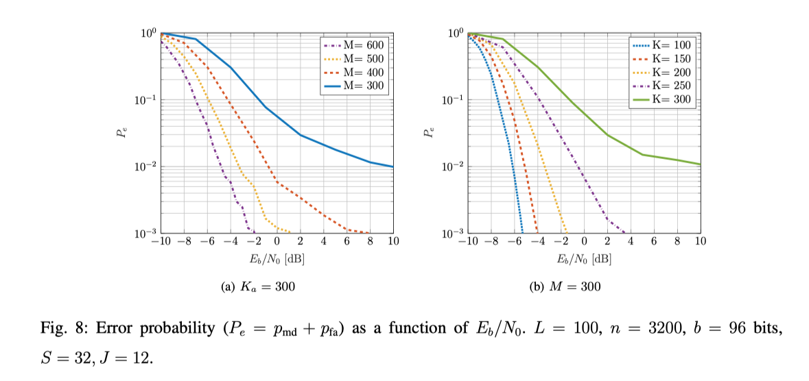

# MMV Activity Detection and Unsourced Random Access
Matlab simulation of
1. The relaxed ML-algorithm for MIMO activity detection described in [1]. (The ML curve of Figure 2 in [1])
2. The concatenated coding scheme for massive MIMO Unsourced Random Access described in [1], which uses the relaxed ML algorithm
as inner decoder and the outer code of [2]. (Figure 8 in [1])

More information about the implemented algorithms can be found in [1]. Please cite it when you use this code.

[1] A. Fengler, S. Haghighatshoar, P. Jung, and G. Caire, “Non-Bayesian Activity Detection, Large-Scale Fading Coefficient Estimation, and Unsourced Random Access with a Massive MIMO Receiver,” arXiv:1910.11266, Oct. 2019. [Link](https://arxiv.org/abs/1910.11266)

[2] V. K. Amalladinne, A. Vem, D. K. Soma, K. R. Narayanan, and J.-F. Chamberland, “A Coupled Compressive Sensing Scheme for Uncoordinated Multiple Access,” arXiv:1809.04745, Sep. 2018. [Link](https://arxiv.org/abs/1809.04745)